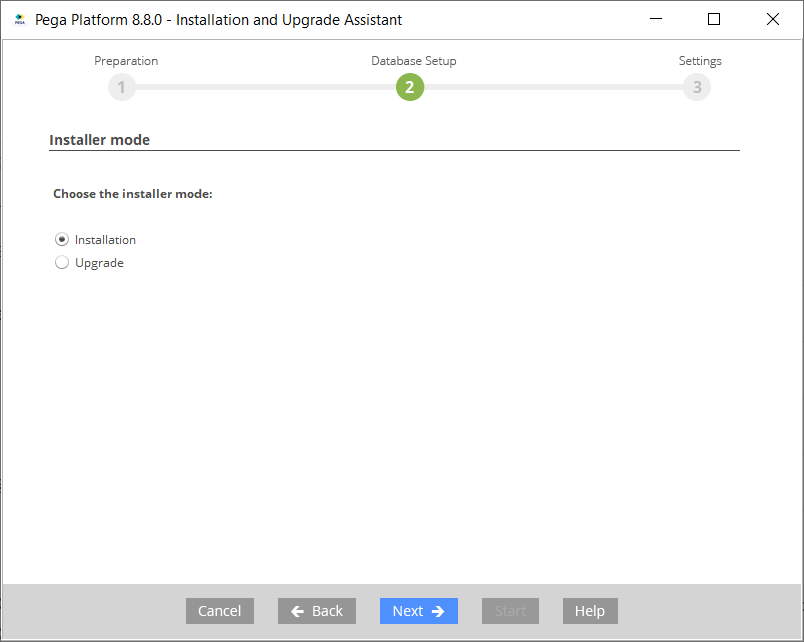
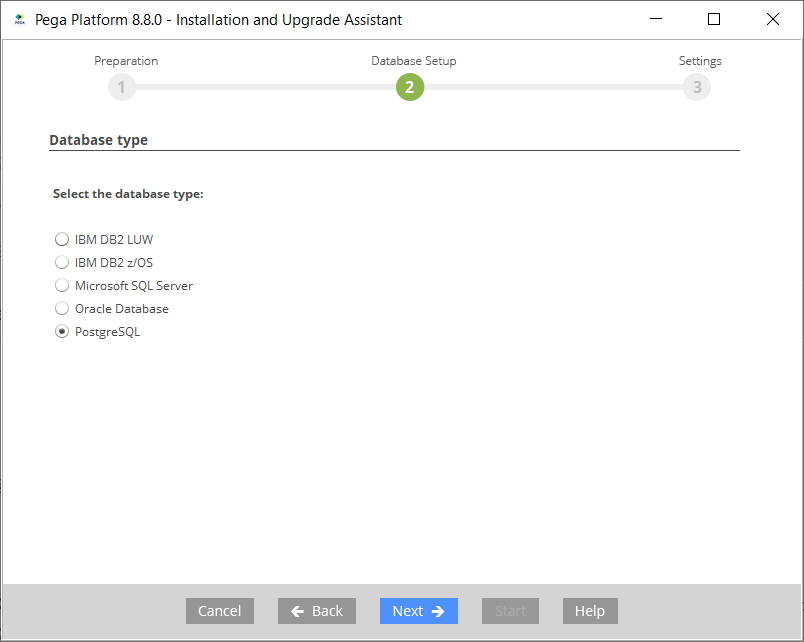
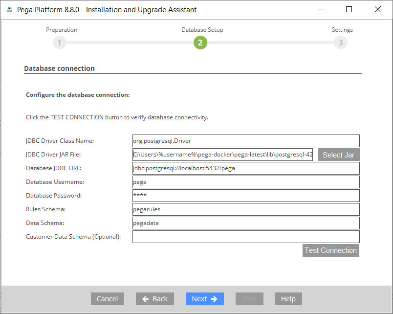
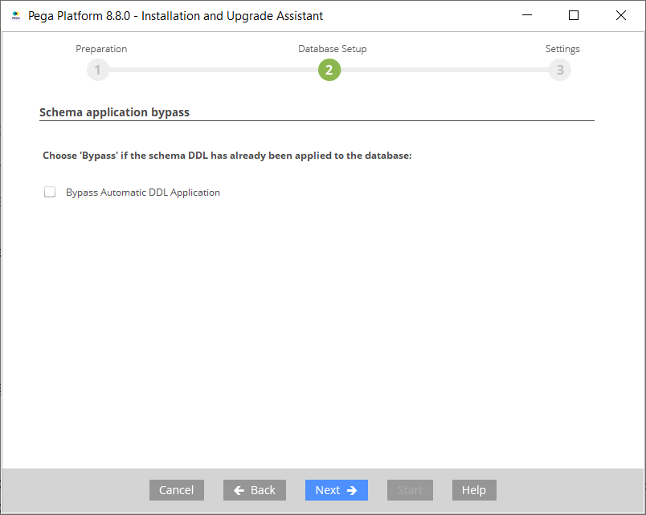
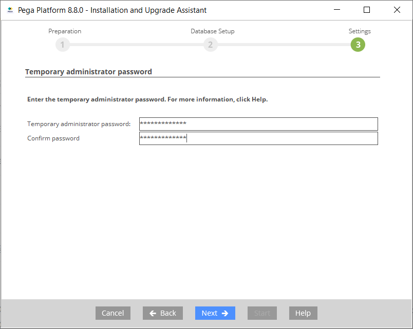
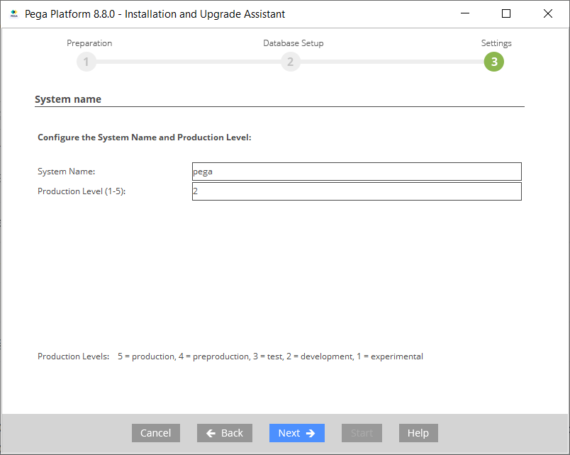
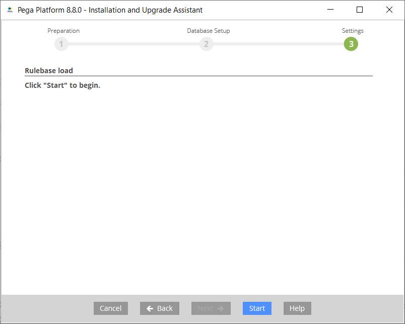
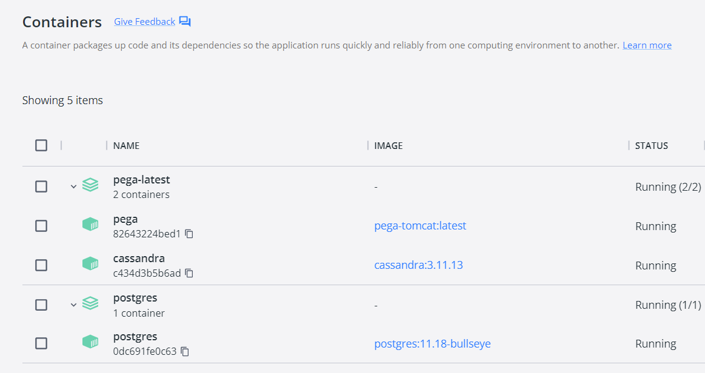

This repo outlines steps to be be able to setup and run Pega Platform as docker container on Windows system.

# Prerequisites

## Install Docker

Download and install docker: https://docs.docker.com/desktop/install/windows-install/

## Download Pega Platform

Download latest Pega Platform from https://my.pega.com/ and extract zip content to local path. E.g.: `C:\Users\%username%\pega_install`

This assumes you have a valid license. Personal edition is also available, but it's not covered here.

## Getting docker images (using command line)

Download Cassandra docker image

### `docker pull cassandra:3.11.13`

Download Postgres docker image

### `docker pull postgres:11.18-bullseye`

Download Pega Tomcat docker image (latest)

### `docker pull pegasystems/pega-ready`

## Create pega tomcat image

Copy `prweb.war` from Pega Installation extract folder (e.g.: `C:\Users\%username%\pega_install\archives`) into lib folder where pega dockerfile will be present. E.g.: if you cloned this repository to `C:\Users\%username%\pega-docker`, copy it into `pega-latest\lib` folder of this repository.

### `cp %userprofile%\pega_install\archives\prweb.war %userprofile%\pega-docker\pega-latest\lib\prweb.war`

Download PostgreSQL JDBC driver corresponding to used Java and Postgres version: https://jdbc.postgresql.org/download/

Copy PostgreSQL JDBC driver to dockerfile lib folder, e.g. using `postgresql-42.5.0.jar`

### `cp %userprofile%\downloads\postgresql-42.5.0.jar %userprofile%\pega-docker\lib\postgresql-42.5.0.jar`

Create or use provided dockerfile and update to match location of prweb.war and PostgreSQL JDBC driver version

[Pega Tomcat Dockerfile](pega-latest/Dockerfile)

#### Build pega tomcat image

### `docker build -t pega-tomcat:latest .`

## Setting up Pega schemas

Create docker compose file for postgres. Example: [Postgres Docker Compose](postgres/docker-compose.yml)

### Start postgres

### `docker-compose up`

### Execute SQL DDL queries is specified order

##### 1

Connect to postgres DB as `postgres` user, using password as defined in docker-compose file. Hostname: `localhost`, port: `5432`

```
CREATE USER pega WITH
  PASSWORD 'pega'
  LOGIN
  SUPERUSER
  INHERIT
  CREATEDB
  NOCREATEROLE
  NOREPLICATION;

CREATE USER externalmktdata WITH
  PASSWORD 'externalmktdata'
  LOGIN
  NOSUPERUSER
  INHERIT
  CREATEDB
  CREATEROLE
  NOREPLICATION;p.
```

Disconnet and connect to postgres DB as `pega` user created above.

##### 2
```
CREATE DATABASE pega WITH 
  OWNER = pega
  ENCODING = 'UTF8'
  LC_COLLATE = 'en_US.utf8'
  LC_CTYPE = 'en_US.utf8'
  TABLESPACE = pg_default
  CONNECTION LIMIT = -1;
```
##### 3
```
CREATE SCHEMA externalmktdata
  AUTHORIZATION externalmktdata;

CREATE SCHEMA pegadata
  AUTHORIZATION pega;

CREATE SCHEMA pegarules
  AUTHORIZATION pega;
  
CREATE SCHEMA sqlj;
```
##### 4
```
GRANT ALL ON SCHEMA externalmktdata TO pega;
GRANT ALL ON SCHEMA externalmktdata TO externalmktdata;
GRANT ALL ON SCHEMA pegadata TO pega;
GRANT ALL ON SCHEMA pegadata TO PUBLIC;
GRANT ALL ON SCHEMA pegarules TO pega;
GRANT ALL ON SCHEMA pegarules TO PUBLIC;
GRANT USAGE ON SCHEMA sqlj TO public;
```
##### 5
```
ALTER ROLE pega IN DATABASE pega SET search_path TO pegarules, pegadata, public;
ALTER USER externalmktdata SET search_path TO externalmktdata, pegadata, public;
```

# Pega Platform Installation

Open Pega Installation extract folder (e.g.: `C:\Users\%username%\pega_install`) and execute `PRPC_Setup.jar`, follow installation steps.

### Select installation or upgrade



### Select database type



### Specify database settings



### Leave `Bypass Automatic DDL Application` unchecked (default)



### Specify temporal admin password used for login to Pega



### Set system and system level. Default settings for development purposes should be good.



### Hit `start` to proceed with installation.



# Running Pega in docker

## Create or use provided pega docker compose file

[Pega Docker Compose](pega-latest/docker-compose.yml)

## Start pega docker

`docker-compose up`

Use Docker Desktop client to manage the instances and check the status. If everything went well, containers should be running.



Open browser and point to http://localhost/prweb/ 

Login to Pega using default admin operator with temporal password created during installation.